# Hiring Coders 2021 - Desafio#3 - VTEX IO + AWS

O desafio tem como objetivo criar uma solução de loja digital. Foi utilizado o
Framework VTEX IO para montar a loja.

## Objetivos

As tarefas a serem cumpridas são (imagens da site base):

1. Criar a solução a partir de um boiler template padrão da Vtex IO
2. Manter uma formatação dos componentes por meio de css e markdown
3. Recriar a página "Desafios" (landingpage) com os seguintes itens:
   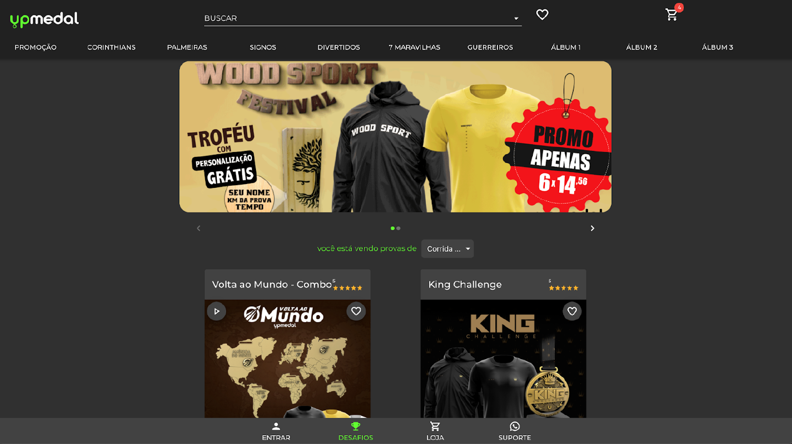

- Header com logo, barra de pesquisa e carrinho
  
- Produtos em destaque
  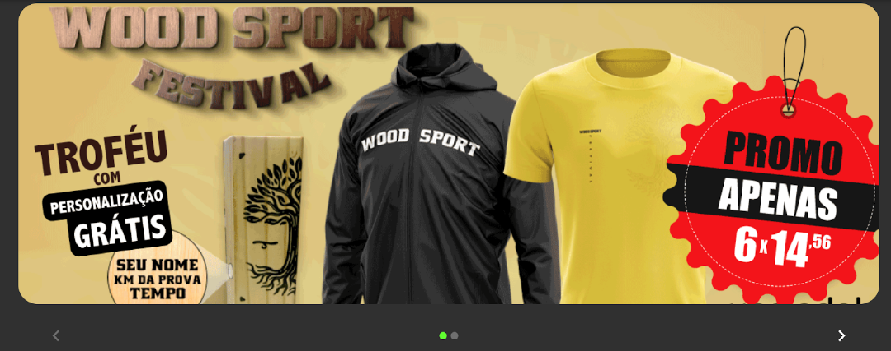
- Lista que separa produtos na página por categoria
  
- Bloco de lista de produtos
  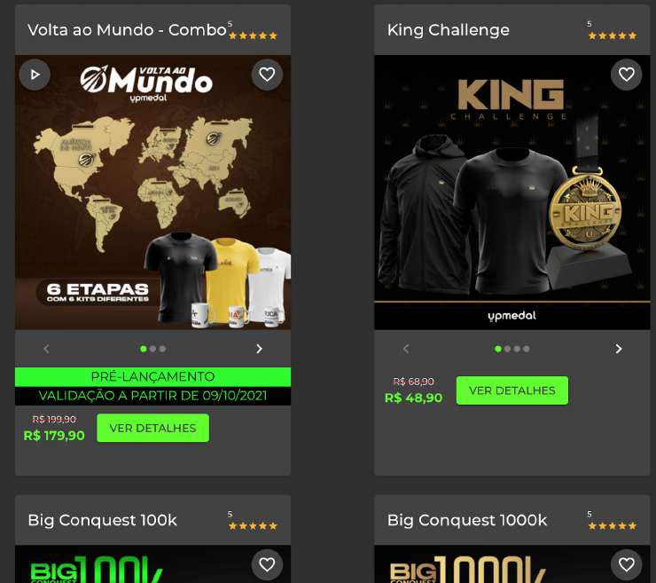
- Menu de páginas do site no footer
  

4. Criar um minicart para finalização de compras
   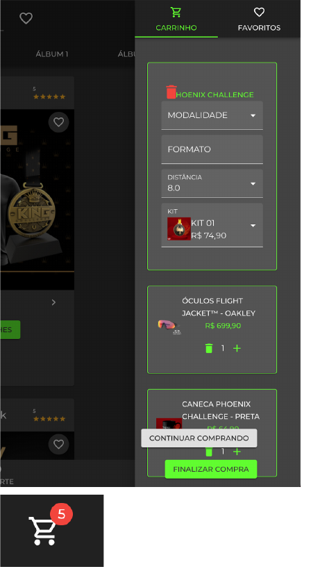
5. Criar as páginas de produtos
   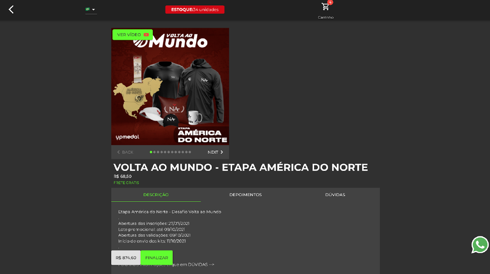
6. Criar formatação para mobile
   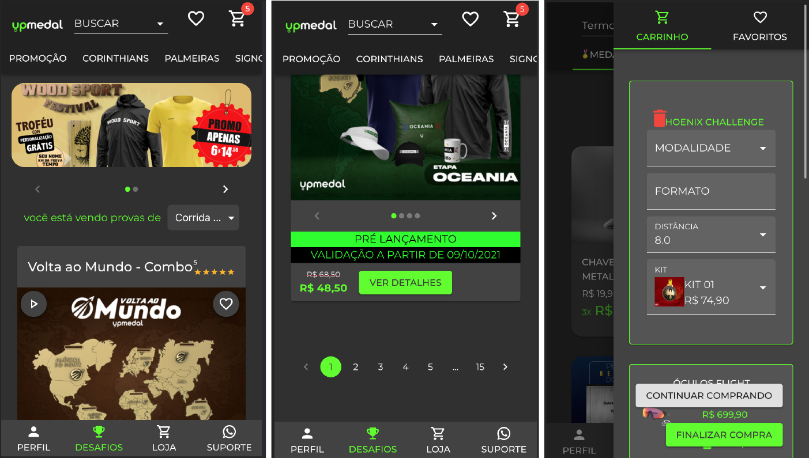
7. Criar componente para conexão com Whatsapp
8. Criar um componente customizado para cadastrar leads
   
9. AWS API Gateway

## Resultados

- [x] Criar a solução a partir de um boiler template padrão da Vtex IO
- [x] Manter uma formatação dos componentes por meio de css e markdown
- [x] Recriar a página "Desafios" (landingpage) com os seguintes itens:
      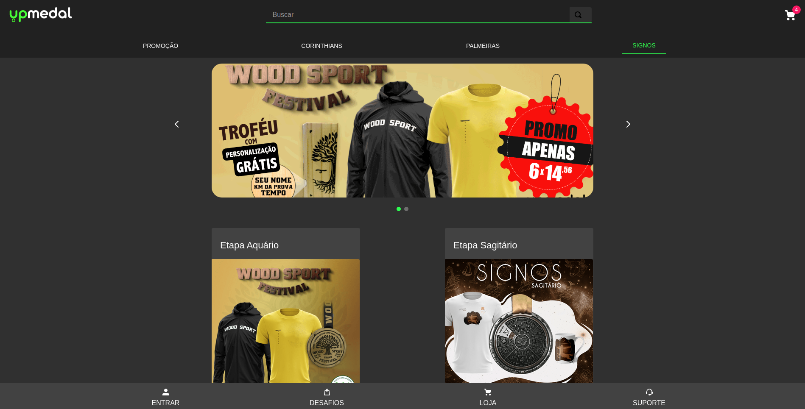
- [x] Header com logo, barra de pesquisa e carrinho
      
- [x] Produtos em destaque
      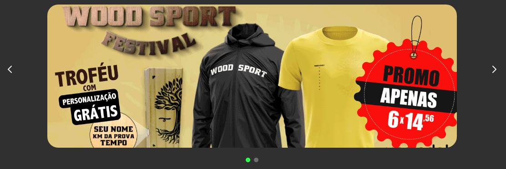
- [x] Lista que separa produtos na página por categoria
      
- [x] Bloco de lista de produtos
      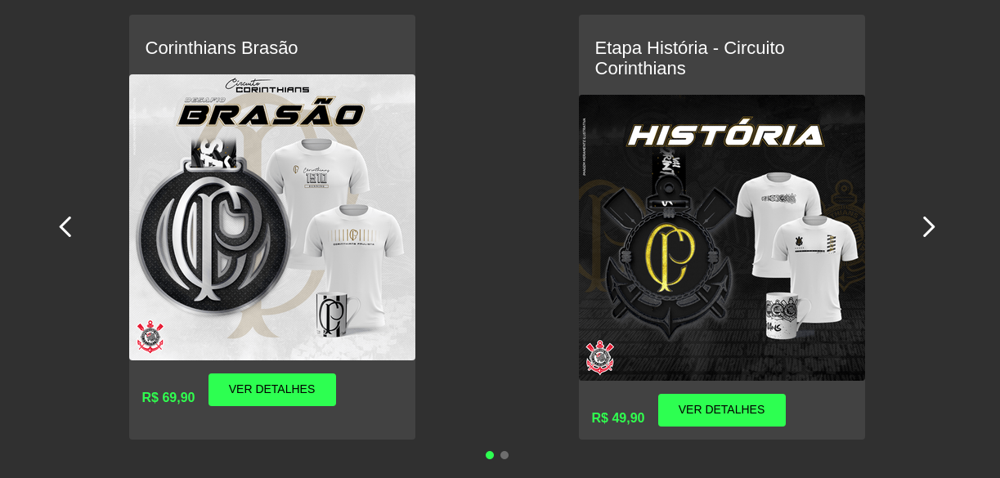
- [x] Menu de páginas do site no footer
      
- [x] Criar um minicart para finalização de compras
      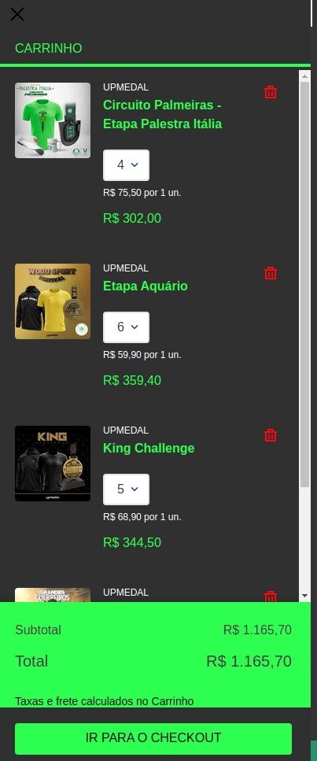
- [x] Criar as páginas de produtos
      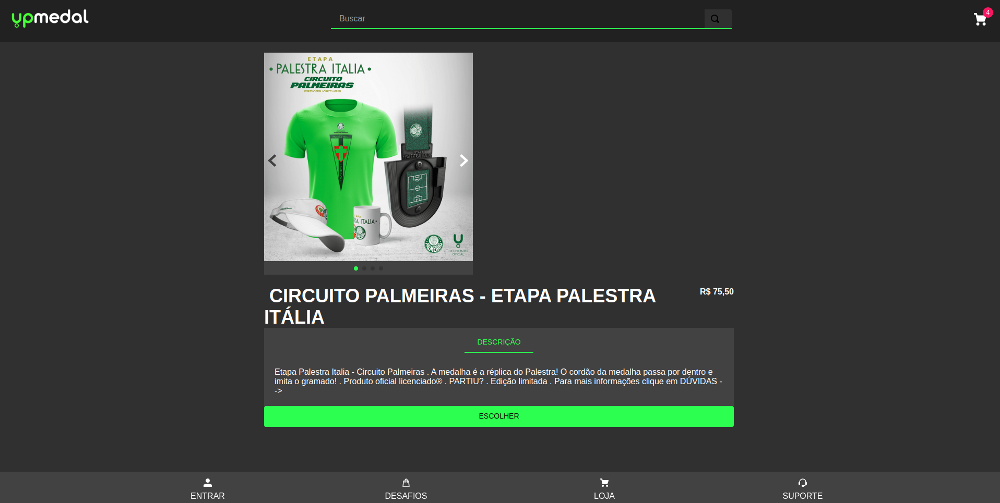
- [x] Criar formatação para mobile
      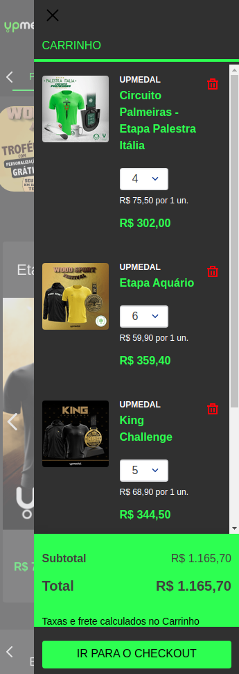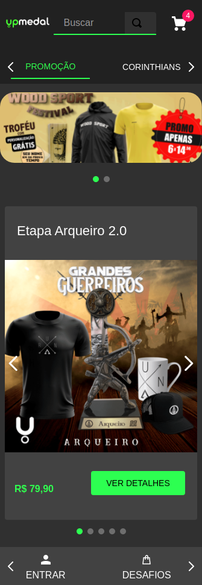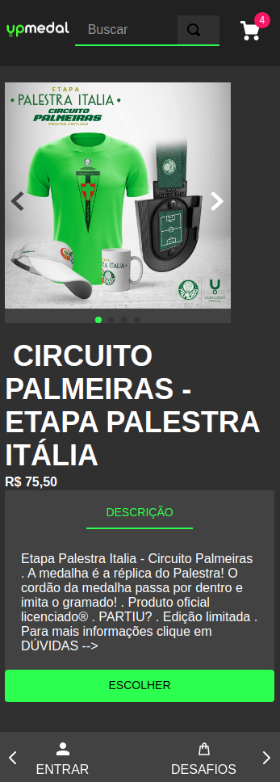
- [x] Criar componente para conexão com Whatsapp
- [] Criar um componente customizado para cadastrar leads
- [] AWS API Gateway
